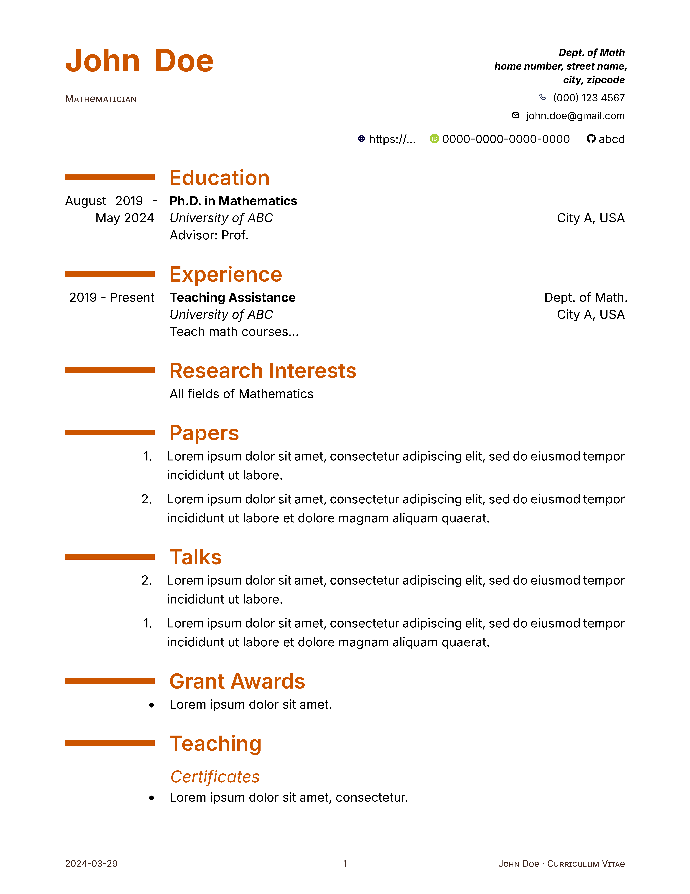

# A Modern CV Template with Typst

This is a Typst resume template that imitates the popular [LaTeX Modern CV template](https://ctan.org/pkg/moderncv).

It was inspired by the Typst template <https://github.com/DeveloperPaul123/modern-cv> created by [DeveloperPaul123](https://github.com/DeveloperPaul123).

## Features

- The default font is Noto Sans. You may set up font in the `theme` dictionary as seen in the `example.typ` file.

- Currently, there are three themes: defult, blue, and orange.

- Enumerate list numbering can be reversed using the function `#reverse[]`. The definition of this function was taken from [frozolotl](https://github.com/frozolotl). I would like to thank [frozolotl](https://github.com/frozolotl) for the help.

## Usage

Below is a basic usage of the template.

```typst
#import "lib.typ": *

// #set text(font: "Merriweather")

#show: resume.with(
  title: "Curriculum Vitae",
  author: (
      firstname: "John", 
      lastname: "Doe",
      email: "john.doe@gmail.com", 
      address: [Dept. of Math\ home number, street name,\ city, zipcode],
      positions: (
        "Mathematician",
      ),
      phone: "(000) 123 4567",
      github: "abcd",
      orcid: "0000-0000-0000-0000",
      web: "https://..."
  ),
  date: datetime.today().display(),
  theme: (
    color: "orange",
    font: "Inter"
  )
)


#show link: set text(fill: blue)

= Education

#resume_entry(
  date: "August 2019 - May 2024",
  title: "Ph.D. in Mathematics",
  university: "University of ABC",
  location: "City A, USA",
  description: "Advisor: Prof. "
)

= Research Interests

#resume_content[
    All fields of Mathematics 
]

= Papers

#resume_list[
  
+ #lorem(15)

+ #lorem(20)

]

= Talks


#resume_list[
  #reverse[
    + #lorem(15)
    
    + #lorem(20)
  ]
]

```

## Sample Output



